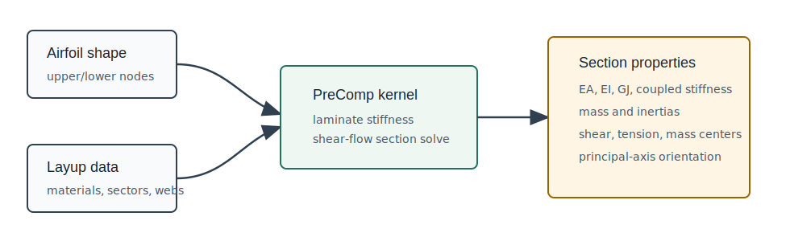

# OWENSPreComp.jl

OWENSPreComp computes equivalent beam-section properties for composite
wind-turbine blades. It is a Julia translation and
automatic-differentiation-aware extension of NREL PreComp, intended for OWENS
coupling and for standalone blade-structural studies.



The package evaluates one blade section at a time. Each section combines:

- external geometry from chord, leading-edge offset, aerodynamic twist, twist
  rate, and normalized airfoil coordinates;
- orthotropic material tables;
- upper- and lower-surface laminate sectors;
- optional shear webs with their own laminate stacks.

The result is an `OWENSPreComp.Output` containing stiffness, coupled
stiffness, inertia, shear-center, tension-center, center-of-mass, and principal
inertia-axis quantities in the PreComp/OWENS sign convention.

The tested high-level workflow is:

```julia
main = OWENSPreComp.readmain("test01_composite_blade.pci")
tw_prime_d = OWENSPreComp.tw_rate(naf, sloc, tw_aero_d)
input = OWENSPreComp.Input(section_geometry..., materials..., layups...)
output = OWENSPreComp.properties(input)
```

The file readers are compatibility tools for legacy PreComp inputs; new coupled
code should pass `Input` values directly where possible.

## Primary Interfaces

| Interface | Use |
| --- | --- |
| `properties(input::OWENSPreComp.Input)` | Preferred Julia interface for one blade section. |
| `properties(chord, tw_aero_d, ...)` | Low-level direct interface used by the `Input` wrapper. |
| `tw_rate(naf, sloc, tw_aero_d)` | Computes twist-rate inputs from spanwise station data. |
| `readmain`, `readmaterials`, `readprecompprofile`, `readcompositesection` | Legacy PreComp file readers used by the regression tests and by file-based workflows. |

`Input` and `Output` are defined in the source but are not currently exported, so call them as `OWENSPreComp.Input` and `OWENSPreComp.Output`.

## Documentation Map

- [Quickstart](quickstart.md) shows installation, package tests, and a compact
  version of the tested file-to-`Input` workflow.
- [Inputs and Outputs](inputs_outputs.md) lists the Julia data contract,
  geometry and layup expectations, file-reader returns, and output fields.
- [Theory, Frames, and Units](theory/frames_units.md) summarizes the PreComp
  assumptions, coordinate frames, units, and sign conventions used by this
  implementation.
- [Validation and Testing](validation.md) records the current pinned checks and
  validation values from the local fixtures.
- [Developer Guide](developer.md) documents where to add tests, how to separate
  parser and kernel changes, and what to check for numerical consistency.
- [Legacy PreComp Guide](guide/precomp.md) preserves the detailed original
  PreComp manual material for users preparing legacy text input files.
- [API Reference](reference/reference.md) provides generated docstrings and an
  index of documented functions and types.
